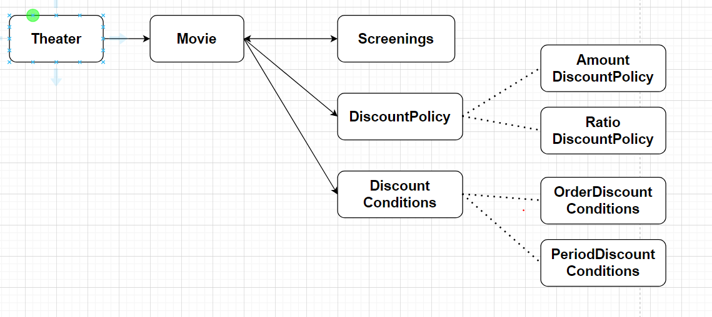

영화와 상영의 개념

할인
* 할인조건(DiscountCondition)
  * 순서조건: ex> 매일 10번째로 상영되는 영화를 할인한다
  * 기간조건: ex> 월요일 10시~1시 사이에 상영되는 영화를 할인한다.
  * 영화별로 N개의 할인조건 할당가능

* 할인정책(DiscountPolicy): 할인요금을 결정 
  * 금액할인정책: 예매 요금에서 일정금액을 할인
  * 비율할인정책: 정가에서 일정비율을 할인
  * 영화별로 하나의 할인정책만 할당가능

